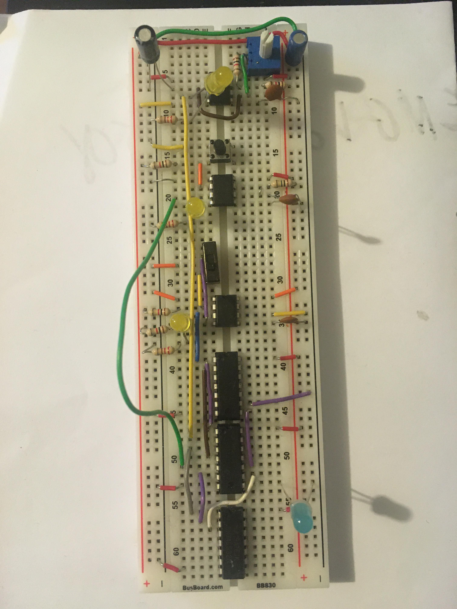
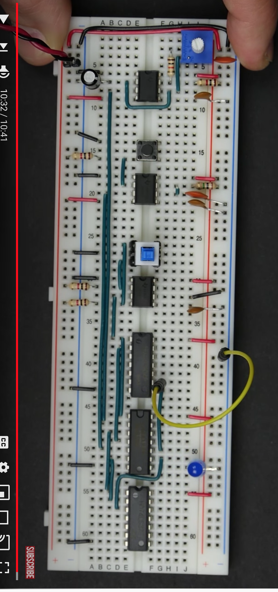
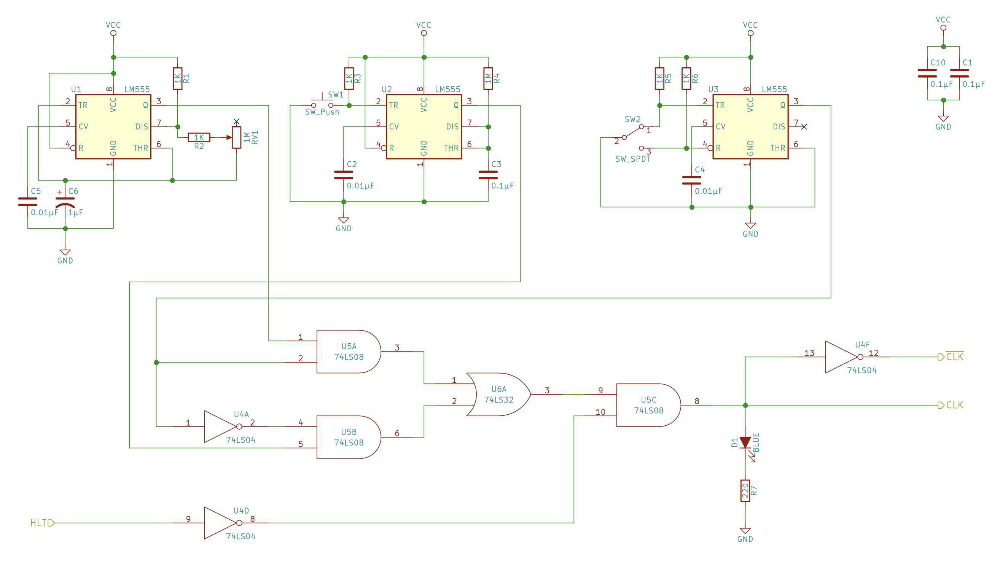
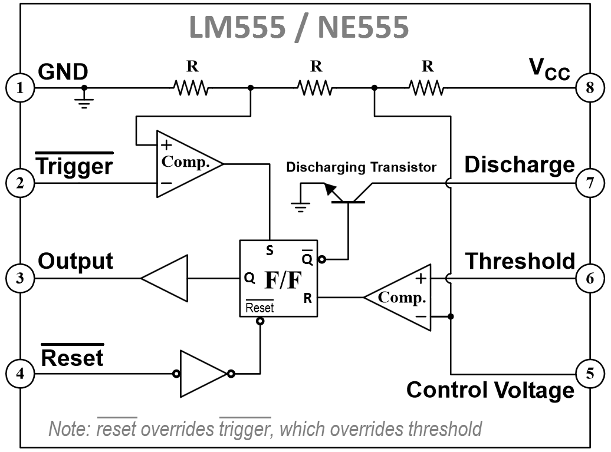
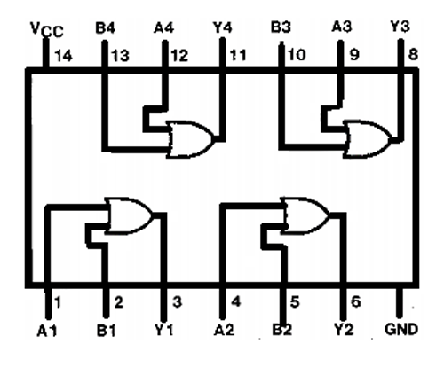
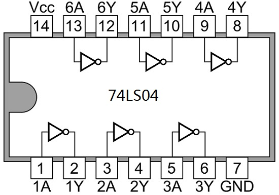

# Clock Module

## Bugfixing first attempt

### Symptoms

When switch is set to astable timer, then top two LEDs flash but blue LED does not.  When the switch is in the other position, then nothing flashes at all, even when the button is pressed.

### Changes

- Moved incorrect U1:3 -> U5:2 amended to expected U1:3 -> U5:1.  Did not fix problems.

## Reference materials in brief

---

**Figure 1**: Buggy board, after first attempt.

---

**Figure 2**: Correct build, completed by instructor.

---

**Figure 3**: Correct schematic circuit diagram.

---

**Figure 4**: Pinout for 555 Timer unit.

---

**Figure 4**: Pinout for 74LS08 QUAD AND unit.

---

**Figure 5**: Pinout for 74LS32 QUAD OR unit.

---

**Figure 6**: Pinout for 74LS04 hex inverter unit.

---

